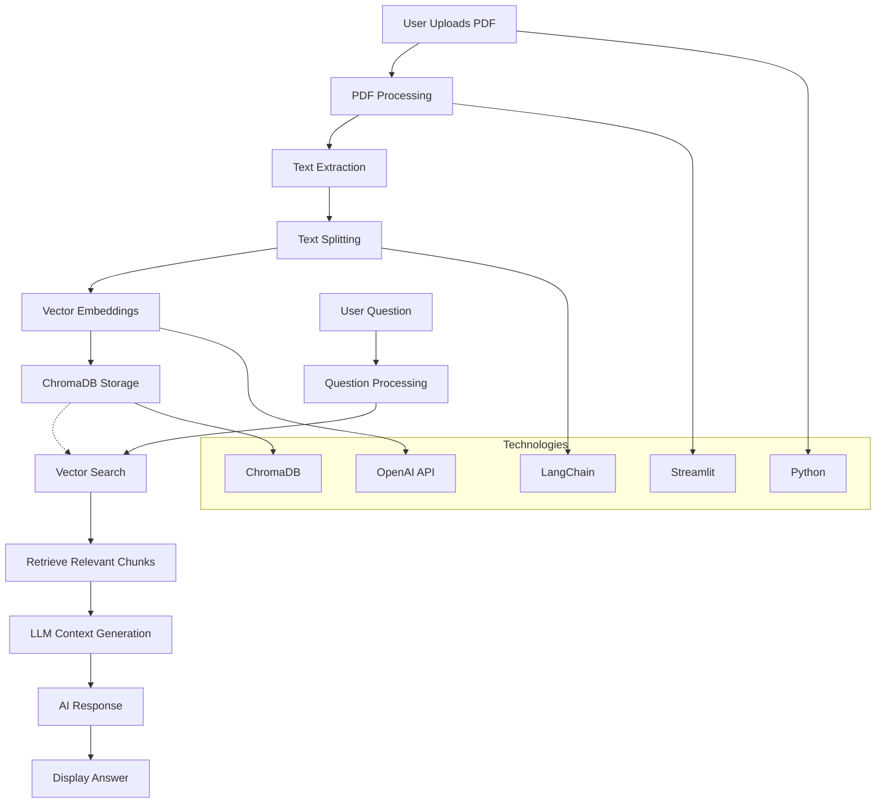

# RAG Chatbot

A Retrieval-Augmented Generation (RAG) chatbot application built with Streamlit and LangChain. This application allows users to upload PDF documents and ask questions about their content using AI-powered responses.

## Features

- 📄 **PDF Document Upload**: Support for multiple PDF file uploads
- 🤖 **AI-Powered Q&A**: Intelligent responses based on document content
- 💾 **Persistent Vector Storage**: Documents are stored in ChromaDB for future use
- 🔄 **Multiple LLM Models**: Choose from various OpenAI models (GPT-3.5, GPT-4, etc.)
- 📊 **Interactive Chat Interface**: Modern Streamlit-based chat UI
- 🎯 **Context-Aware Responses**: Uses RAG methodology for accurate answers

## Architecture & Flow



## Technology Stack

| Component | Technology | Purpose |
|-----------|------------|---------|
| **Frontend** | Streamlit | Web interface and chat UI |
| **Backend** | Python | Core application logic |
| **AI Framework** | LangChain | RAG pipeline and LLM orchestration |
| **Vector Database** | ChromaDB | Document embedding storage |
| **LLM Provider** | OpenAI | Language models for responses |
| **Document Processing** | PyPDF | PDF text extraction |
| **Text Splitting** | LangChain Text Splitters | Document chunking |
| **Environment Config** | python-decouple | Configuration management |

## Installation

1. **Clone the repository**
   ```bash
   git clone https://github.com/luizaugustoliveira/RAG-Chatbot.git
   cd RAG-Chatbot
   ```

2. **Create and activate virtual environment**
   ```bash
   python -m venv venv
   source venv/bin/activate  # On Windows: venv\Scripts\activate
   ```

3. **Install dependencies**
   ```bash
   pip install -r requirements.txt
   ```

4. **Set up environment variables**
   Create a `.env` file in the root directory:
   ```
   OPENAI_API_KEY=your_openai_api_key_here
   ```

## Usage

1. **Start the application**
   ```bash
   streamlit run app.py
   ```

2. **Upload documents**
   - Use the sidebar to upload PDF files
   - Wait for processing to complete

3. **Ask questions**
   - Type your questions in the chat input
   - Select your preferred LLM model from the sidebar
   - Receive context-aware responses based on your documents

## Project Structure

```
RAG-Chatbot/
├── app.py                 # Main Streamlit application
├── requirements.txt       # Python dependencies
├── .env                  # Environment variables
├── db/                   # ChromaDB storage directory
├── README.md             # Project documentation
└── venv/                 # Virtual environment
```

## Key Components

### PDF Processing Pipeline
- **Text Extraction**: Uses PyPDFLoader to extract text from PDFs
- **Document Splitting**: RecursiveCharacterTextSplitter creates manageable chunks
- **Vector Embeddings**: OpenAI embeddings convert text to vectors

### RAG Pipeline
- **Retrieval**: ChromaDB finds relevant document chunks
- **Augmentation**: Retrieved context is added to the prompt
- **Generation**: LLM generates responses based on the context

### Storage & Persistence
- **Vector Store**: ChromaDB persists document embeddings
- **Session Management**: Streamlit maintains chat history

## Configuration

The application supports the following OpenAI models:
- gpt-3.5-turbo
- gpt-4
- gpt-4-turbo
- gpt-4o-mini
- gpt-4o

## Acknowledgments

- [LangChain](https://python.langchain.com/) for the RAG framework
- [Streamlit](https://streamlit.io/) for the web interface
- [OpenAI](https://openai.com/) for the language models
- [ChromaDB](https://www.trychroma.com/) for vector storage